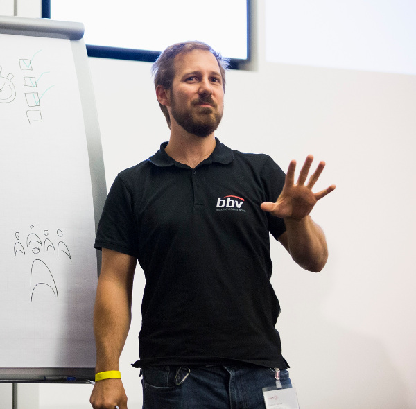

name: title
layout: true
class: center, middle, inverse

.footer[ [ @BernerDominik](https://twitter.com/BernerDominik)]
---

Mit 7 Erfolgsfaktoren organisatorische Veränderungen meistern
===

### Change management greifbar

#### Dominik Berner - Coder, Agilist, Rock Climber

???

# Begrüssung

# Veränderungen sind allgegenwärtig, agile transformationen, digitalisierung

Oft schlecht organisiert, nicht der gewünschte Effekt, Alter Wein in neuen Schläuchen
"Wir machen mal agil" und dann rennen alle Kopflos davon und bleiben doch stehen

# Erfolgsfaktoren als methode zur reflektion

Keine Checkliste, aber ein Hilfsmittel, damit die richtigen Fragen gestellt und beantwortet werden

---

# Dominik Berner

### C++ Coder, Agilist & Rock Climber
.left-column[
 
]
.right-column[
.left[
[ dominikberner.me](http://dominikberner.me)

[ @BernerDominik](https://twitter.com/BernerDominik)

[ bernedom](https://github.com/bernedom)

[ dominik.berner@bbv.ch](mailto:dominik.berner@bbv.ch)

.center[

]

]

]
 

???

# 10+ Jahre erfahrung mit (modernem) C++
# Moderne unternehmensformen statt blinde agilität
# System thinker

Startup von 10 auf 70 mitarbeiter begleitet und gesteuert
SAFe Einführung am eigenen Leib in grossfirma
Verschiedene Teams agilisiert

---

# Die 7 Erfolgsfaktoren

* Veränderungsbedarf
* Unterstützung und Reflektion
* Veränderungsfähigkeit und -Bereitschaft
* Führung und Leitung
* Vorgehen
* Widerstand
* Unternehmenskultur

???

* Keine Checkliste
* Hypothese - Verifikation - Adaptieren
* Faktoren sind vernetzt, schrauben an einem beeinflusst die anderen
* Zu jedem eine explizite Aussage machen können

---

# Veränderungsbedarf - Der Motor

* Differenz Ist - Soll
* Warum machen wir das überhaupt
* Verschiedene Fluglevel

???

# WARUM ist wichtiger als WAS

Gute, nachvollziehbare Gründe müssen her. 
Weg vom offensichtlichen
Motor und Anker, Grundannahme auf die wir uns immer wieder beziehen
Aktive Abgrenzung zum Universum - Das ist der Bedarf den wir Jetzt angehen, den dort drüben der kommt dann später
Vom groben ins feine und umgekehrt. 

Schlecht: Wir müssen agiler werden
Besser: Unsere lead time für Projekte ist zu gross

---

# Führung und Leitung - Die Kapitäne

* Explizite Personelle Führung, wer treibt dies
* "Hält" die vision
* Auch Change Manager genannt
* Evtl. Auch Führungsgruppe
* Gestaltet "Soll" Greifbar - Kapitän auf dem Schiff

???

Führung statt Mangement 
Wer kann uns wo führen, wer hat inhaltliche autorität? 
Stellt vision bereit und bindet sie zum Veränderungsbedarf

---

# Veränderungsfähigkeit - Befähigte Crew

* Veränderungsfähigkeit: Können und Wollen
* Veränderungsbedarf: Müssen
* Veränderungsfähigkeit muss evtl. erst erstellt werden in der Belegschaft
* Wo sind harte Grenzen
* Auch Methodenkompetenz von Führungsgruppe

???

Bsp: Agile transformation - Haben wir jemanden der Agile kann? 
Scrum lernen, Scrum Masters

Harte Constraints: bsp: Medizinsektor: Ohne testing gibts nichts

---

# Unterstützung und Reflektion - Der Bootsmann

* Bringt methodenkomptenz - Führung und Belegschaft
* Sounding board für Change Manager
* Kein "skin in the game"
* Erfahrungen ausserhalb aktueller Firma/Kontext
* Change Coach

???

A propos reflektion - überleitung zu Vorgehen

---

# Kurze Feedbackzyklen - Vorgehen

* Veränderungen sind komplexe Angelegenheiten
* Häufige kurze Experimente statt langer, ausgefeilter plan
* Feedback, Feedback, Feedback
* Feedback zuerst als Organisation lernen? 

---

# Widerstand - Der Sturm voraus

* Aktiver & Passiver widerstand
* Widerstand zeigt, dass die Veränderung wahrgenommen wird
* Gute Feedbackkultur und kurze Zyklen, damit passiver Widerstand aktiv wird
* Widerstand wird nie ganz verschwinden
* Grosser Widerstand --> überprüfung der Veränderungsfähigkeit, Führung und Veränderungsbedarf
* Mehrere Kulturen
* Basisannahmen, Normen & Standards, Symbole und Zeichen
* Kultur zunutze machen

---

# Unternehmenskulturen - Die Meeresfauna

* Haben wir eine Kultur die Veränderungen gutheisst?
* Top-Down oder Bottom up? 
* Diversität der Kulturen (z.b. Werkstatt vs. R&D)

---

Unterstützung und reflektion
OK Veränderungsbedarf - Was/Warum wollen wir 
Veränderungsfähigkeit und bereitschaft
Führung und Leitung
Vorgehen - Kurze Feedback zyklen
Widerstand
Unternehmenskultur

Notizen / Backup

???

ADKAR Modell Googlen VEränderun

Ob neue Technologien, (agile) Transformationen, neue Arbeitsmethoden oder die vielbeschworene Digitalisierung und DevOps: Veränderungen in Unternehmen sind heute allgegenwärtig. Das kann mitunter anstrengend und frustrierend sein, denn oft greifen diese Veränderungen tief in den Alltag der Betroffenen ein. Wer kennt nicht mindestens eine Horror-Story von einem gescheiterten Veränderungsprozess? Die Geschichten von ziellosem umherirren im Methodendschungel unstrukturierten Prozessexperimenten oder diktatorischem Umorganisieren mit Brechstangenmethodik sind zahlreich.Doch das muss nicht sein! Veränderungen können und sollen positiv erlebt werden. Im Zusammenspiel von sieben Erfolgsfaktoren ist eine zielgerichtete und nachhaltige Veränderung deutlich leichter zu erreichen. Welche Faktoren das sind und wie sie praxisnah erkannt und umgesetzt werden, können zeige ich in diesem Vortrag. Ihr lernt eine konkrete Methode zur Umsetzung von kleineren und grösseren organisatorischen Veränderungen kennen und nehmt eine Liste von Fragen mit, die in der nächsten Veränderung beantwortet werden wollen.