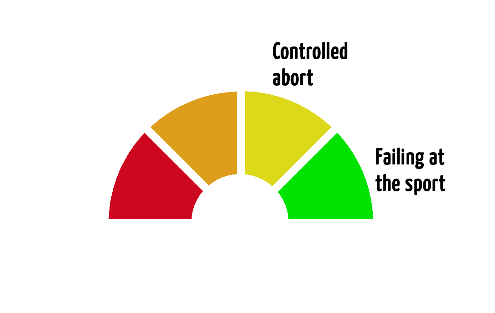

name: title
layout: true
class: center, top, inverse
background-position: center
background-repeat: no-repeat
background-size: contain

.footer[ [ @BernerDominik](https://twitter.com/BernerDominik)]
---
class: center, middle, inverse
background-image: url(images/title_background.jpg)

# Die Freude am Scheitern

## Dominik Berner
### Software Engineer, Agilist, Rock Climber

???
 
#"Wir lernen nur durch scheitern" - reinhold messner

Das gilt nicht nur fürs Klettern, sondern überall im Leben. 

Ihr kennt mich als Software Ingineur und Agilist, aber ich bin auch begeisterter Kletterer
Seit über 10 Jahren besteige ich Berge. 

---
background-image: url(images/oben_sein.jpg)
# Hoch steigen!

???

Erfolge sind cool und geben uns Mut

# Geschichte erzählen

Stellt euch vor... 
 
* Oben auf dem Gipfel stehen, wissend, dass man toughes geleistet hat. Tief einatmen, aussicht geniessen
* Software ausgeliefert, wissend dass man da was nützliches gebaut hat. Tief einatmen, Kundenfeedback geniessen

 wieder runterkommen und noch Jahrelang vom Trip Schwärmen
 - Software Ausliefern, Kundenzufriedenheit über Jahre erleben - Noch Jahrelang vom Erlebnis schwärmen

# Schön wenn es klappt - Der Alltag sieht oft anders aus!

---
background-image: url(images/Falling.jpeg)
#Tief fallen!

.credit[
  https://www.stocksy.com/1198104/rock-climber-falling-whilst-climbing-a-mountain-cliff
]
???

## hoppla das wäre schöner gegegangen
bis zu
## Fatale Konsequenzen 

Das fängt beim "hups ich hab mich am Haken festgehalten" and und endet dort wo jemand verletzt wird oder stirbt. 
Kleine unschönheiten in der Software bis zu, boing 737 debakel, Fehler die unternehmen und Lebensgrundlagen zerstören. 

Klettern gibt Einblicke in wie wir scheitern. Das Scheitern ist dort oft unmittelbarer und greifbarer als in der Software. Das Restrisiko spielt mit, aber man hat es selbst in de hand. Über die Jahre habe ich das Scheitern selbst etwas genauer unter die Lupe genommen. 

# Arten von Scheitern

--

???

# Zwischen den extremen gibt es Zwischenschritte

---
background-image: url(images/Falling.jpeg)
#Tief fallen!

???

## Am Sport Scheitern/Sportlich scheitern 
   Nicht so nice, TDD nicht geklappt, Technologie nicht ideal, route nicht rotpunkt
   **Passiert uns täglich, normalbetrieb** 

---
background-image: url(images/Falling.jpeg)
#Tief fallen!

???

## Kontrollierter Abbruch 
   Stichwort kontrolliert, Der Gipfel bleibt unerreichbar, zurück auf den Boden. Feature lässt sich so nicht ausliefern, zurück auf start nochmals aufrollen, architektur überdenken. Code endet nicht in der Produktion 
   **und dann nochmals vom Boden auf einsteigen**  
   **Passiert uns ab- und zu mal** - Kann dennoch ganz OK sein. 

---
background-image: url(images/Falling.jpeg)
#Tief fallen!

???

---
background-image: url(images/Falling.jpeg)
#Tief fallen!

???

## Nochmals davon kommen" 
  Teilweise Kontrollverlust. Nur Glück entscheidet über Ausgang - Code ist in produktion, man merkt es aber bevor schlimmeres passiert.  jemand ist bereits leicht verletzt, man lässt Material am Berg.
  **Selten, aber wenn...** 

## Katastrophaler Fehlschlag
 Glück hat nicht gereicht, Konsequenzen sind potentiell Schwerwiegend. Von längerer downtime bis "Du wirst nie mehr Klettern/Programmieren. 
 Code ist nicht nur in produktion sondern schaden ist auch aktiv
  - Herzschrittmacher mit Zeitüberlauf 256 Schläge/min
  - Boeing 737
 **Hier wollen wir ums verrrecken nicht sein!**

### Die Grenzen zwischen den Sektoren sind unscharf und individuell
- Können und Erfahrung

# Aber wo ist die Freude?

---
background-image: url(images/Falling.jpeg)
# Zu weit gehen

???

# An der Grenze zwischen Gelb und Orange passiert etwas spannendes

Man ist unbewusst zu weit gegangen und hat ein Teil der Kontrolle verloren. 

Orange: Vermutlich viele kleine Aspekte die uns hierhin gebracht haben.
 - Ob selbst schuld oder nicht ist egal

# Geschichte: Haken nicht richtig gesetzt, Pendelsturz Fersenbeinbruch - Exit aus Route
# DB Update verhauen - Alle Order der letzten 24h weg

## Hier lernt man extrem viel über sich

* Kleinhirn setzt ein "Flight, Fight or Freeze"
* Dem gilt es zu widerstehen - Erfahrung Hilft hier viel

Dann wenn das kleinhirn überwunden ist: **Ziel wieder die kontrolle erreichen**
* Voller Fokus alles gelernte wird aktiviert und angewendet
  * Rollbacks, Schaden eingrenzen, Krisenkommunikation 
* Teamwork wird enorm wichtig
  * Braucht vertrauen und brutale Ehrlichkeit auch sich selbst gegenüber
* Man lernt sich selbst kennen - 

Schritt für Schritt wird die Lösung erarbeitet
- Ein zusätzlicher Haken hier, Trickkiste der Knöpfe etc
- SW Rollback, Stabilisieren, 

Bis man wieder im gelben ist.
Versuchung zu widerstehen dass nun alles Grün ist. 
ohne abstieg auf den Boden nicht mehr werden.

**Man muss wissen wie weit man zu weit gehen darf**

# Man entschärft die Situation, und geht runter. Und dann?

---
background-image: url(images/retro.jpg)
# Runterkommen - Retrospektive

.credit[
  http://www.fornohuette.ch 
]

???

# Der entscheidende Schritt.

Man ist unten in der Hütte, Kollege mit Rega weg. Man ist im Bier, der Server läuft wieder - so wie vorgestern
Revue passieren lassen, darüber reden. 

**Vielleicht erst mit ein paar Tagen Abstand möglich**

daran wachsen, merken wo man noch aufzuholen hat. 

---
background-image: url(images/celebrate_success.jpg)
# Die Freude am Scheitern

???

Und dann ist man wieder zurück am Fels 
Oder man packt die Software nochmals an

Vorbereitet, Nervös und los gehts

Schlüsselstelle voller Angst - 

Oben ankommen wissen dass man es besser gemacht hat als man es vorher gekonnt hätte

# Das meine Freunde ist die Freude Am Scheitern 
# Danke!

